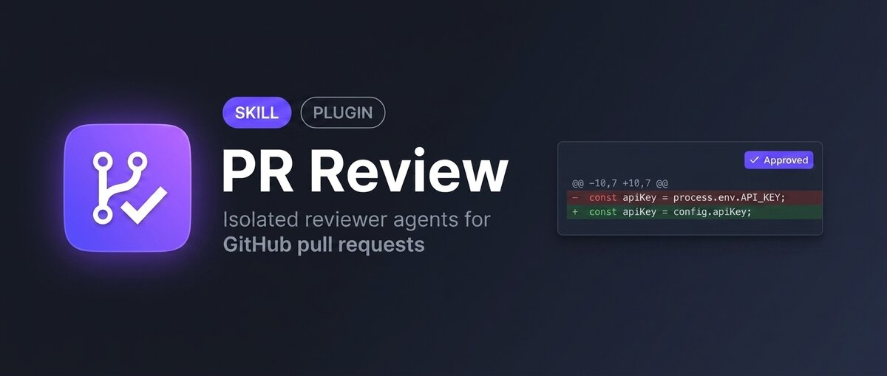

# PR Review Plugin



PR Review is a Claude Code and Codex plugin for reviewing GitHub pull requests with reviewer agents that operate on a repeatable PR snapshot and return structured findings.

It gathers PR metadata, changed files, diffs, prior comments, and repository context into a repeatable review snapshot. Review requests produce structured findings and ask before posting eligible GitHub comments.

```text
Pull Request
      |
      v
Context Collector
      |
      v
Reviewer Agent(s)
      |
      v
Structured Findings
      |
      v
Comment Publisher
```

## Install

Claude Code:

```text
/plugin marketplace add shinpr/pr-review-skill
/plugin install pr-review@pr-review-tools
```

Codex:

```sh
codex plugin marketplace add shinpr/pr-review-skill
codex plugin add pr-review@pr-review-tools
```

Then start a new Claude Code or Codex session so the installed skill is loaded.

## Use

Claude Code uses slash commands:

```text
/recipe-pr-review Review this PR.
```

```text
/recipe-pr-review Review this PR and prepare must and should findings for posting.
```

```text
/recipe-pr-review Review https://github.com/owner/repo/pull/123. Review only and leave the PR unchanged.
```

Codex uses skill invocation with `$`:

```text
$recipe-pr-review Review this PR.
```

```text
$recipe-pr-review Review this PR and prepare must and should findings for posting.
```

```text
$recipe-pr-review Review https://github.com/owner/repo/pull/123. Review only and leave the PR unchanged.
```

The first run creates `.agents/pr-review/config.yaml` and an empty quality profile at `.agents/pr-review/quality/code.yaml` if they are missing. The plugin leaves repository ignore rules under your control.

## Configuration

Repository settings live in `.agents/pr-review/config.yaml`. The file controls where review state is stored, which quality profile is loaded, which reviewer engines run, and which finding severities are eligible for GitHub posting.

Default config:

```yaml
version: 1
posting:
  severities:
    - must
    - should
review:
  default_engine: self
  additional_engines: []
  output_language: en
quality:
  path: .agents/pr-review/quality/code.yaml
workspace:
  tmp_dir: .agents/tmp/pr-review
guidance:
  include_files:
    - AGENTS.md
    - CLAUDE.md
    - .github/copilot-instructions.md
```

### Posting

Before sending GitHub comments, the skill shows a posting summary and asks for approval.

Change `posting.severities` to choose which of `must`, `should`, `question`, and `nit` are posted.

Reviewers may still produce findings outside this list. `posting.severities` is the posting cutoff, not the review cutoff. For example, the default posts only `must` and `should`; `question` and `nit` stay in the local review output.

### Review Engines

Set `review.default_engine` to `self`, `claude`, or `codex`. `self` means Claude Code uses the Claude Code reviewer and Codex uses the Codex reviewer. Add the other engine to `review.additional_engines` when you want both reviewers.

When both reviewers run, the host agent combines their JSON outputs by root cause using the collected PR snapshot. The combined JSON is validated against the review schema. Exact duplicate prevention still runs at posting time as a safety net.

`review.output_language` controls the language used in human-facing review text. JSON keys and severity labels stay English.

Claude reviewer runs use Claude Code permission bypass with write tools disabled, so non-interactive reviews do not stop on permission prompts. Use this plugin for repositories and PRs you are willing to inspect from your local machine. Codex reviewer runs use Codex read-only sandboxing.

### Paths And Context

`quality.path` points to the repository-specific quality profile. The first run creates an empty profile there when the file is missing.

`workspace.tmp_dir` is where collected PR snapshots, diffs, prior comments, and reviewer JSON are written while a review is running. Successful posting can clean this directory; failed runs keep it for inspection.

`guidance.include_files` adds repository guidance documents to reviewer context.

## How Reviews Are Posted

The reviewer returns structured findings first. GitHub comments are sent after the user approves the posting summary. The configured severity list controls which findings are eligible.

## Quality Profile

Use the quality profile for repository-specific review expectations. Prefer rules derived from the repository itself, such as API contracts, schema conventions, generated-code ownership, migration procedures, security boundaries, deployment constraints, and testing requirements.

Ask the skill to create or improve it from repository sources:

```text
/recipe-pr-review Create a quality profile for this repository.
```

```text
$recipe-pr-review Create a quality profile for this repository.
```

When creating a quality profile, the skill inspects repository sources such as `AGENTS.md`, `CLAUDE.md`, `README.md`, `CONTRIBUTING.md`, docs, CI workflows, package scripts, Makefiles, schemas, API clients, tests, and deployment notes. It proposes changes before updating the profile.

Quality rules are concrete, repository-specific `pass` conditions:

```yaml
project_rules:
  - id: api-error-contract
    pass: API handlers return the repository-standard error envelope and clients parse that envelope through the shared client utilities.
  - id: generated-schema-ownership
    pass: Generated schema files are updated through the documented generator command, with source schema changes in the same PR.
```

Rules describe repository-specific expectations that can be verified from the PR.
